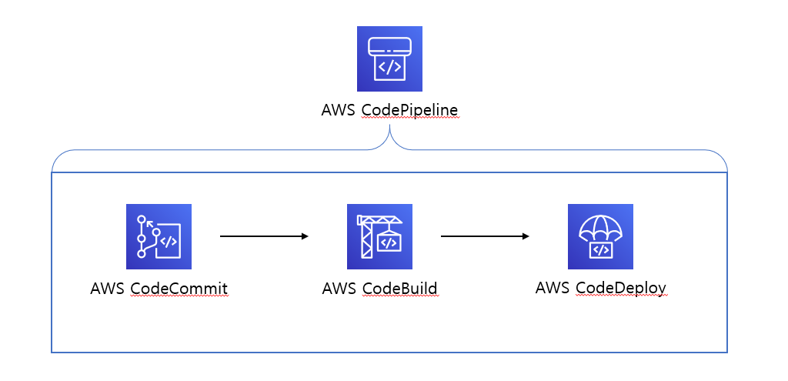

Code 시리즈를 이용한 CI/CD 구성
==================
Architecture Overview
------------------


시작하기 전에
------------------
아래 사항들은 AWS Seoul Region을 기준으로 작성되었으며, 아래 AWS 공식 LAB을 이용해 진행하였음을 안내드립니다.

>CodeBuild용 CodeDeploy 샘플<br>
>https://docs.aws.amazon.com/ko_kr/codebuild/latest/userguide/sample-codedeploy.html

목차
------------------

1. **CodeCommit**<br>
  1-1. CodeCommit 레포지토리 생성 및 설정<br>
  1-2. SVN 데이터 Git으로 이전<br>
2. **배포 시나리오 도출**<br>
3. **CodeBuild**<br>
  3-1. buildspec.yml 파일 생성<br>
  3-2. Build 환경 구성
4. **CodeDeploy**<br>
  4-1. appspec.yml 파일 생성<br>
  4-2. 배포 방법 설정 및 대상 지정<br>
5. **CodePipeline**<br>
  5-1. 파이프라인 생성<br>
  5-2. 테스트<br>

------
# 1. CodeCommit
## 1-1. CodeCommit 레포지토리 생성 및 설정
### **CodeCommit 레포지토리 생성**
1. AWS Management Console 좌측 상단에 있는 **[Services]** 를 선택하고 검색창에서 codecommit 을 검색하고 [CodeCommit] 을 선택합니다.
2. 좌측탭에서 **[리포지토리]** 선택 후 **[리포지토리 생성]** 클릭합니다
3. 레포지토리 이름 입력 후 **[생성]** 클릭합니다

### **IAM User 생성 및 권한 부여**
CodeCommit은 원격 접속이 가능한 User를 IAM User를 통해 제공하고 있습니다.<br>
CodeCommit에 접근하기 위한 방법으로는 HTTPS 방식과 SSH 방식이 있는데, 두 Credential 모두 IAM User에 등록 및 할당받을 수 있습니다.

### IAM User 생성

>IAM 사용자 생성
>https://docs.aws.amazon.com/ko_kr/IAM/latest/UserGuide/id_users_create.html#id_users_create_console

### IAM User에 권한 부여

IAM User는 CodeCommit Git 에서도 사용되기 때문에, IAM User에게 Git과 관련된 권한이 없으면 아무런 동작도 실행할 수 없습니다.<br>
따라서 아래 절차를 통해 CodeCommit 관련 권한을 부여하고, 유저별로 특정 권한을 Deny 해보도록 하겠습니다.

1. AWS Management Console 좌측 상단에 있는 **[Services]** 를 선택하고 검색창에서 iam 을 검색하고 [IAM] 을 선택합니다
2. 좌측탭에서 **[사용자]** 선택 후 사용자 리스트에서 위에서 생성한 IAM User를 클릭합니다
3. 요약 페이지로 이동되었다면, **[권한 추가]** 버튼을 클릭합니다
4. 상단에서 **[기존 정책 직접 연결]** 을 선택한 후 검색창에서 "codecommit" 을 검색하고 [AWSCodeCommitFullAccess] 를 선택합니다.
5. **[다음: 검토]** 버튼을 누른 후 **[권한 추가]** 버튼을 누릅니다

위 작업을 통해 생성 된 IAM User에 CodeCommit 레포지토리에 commit, push 등 모든 작업을 할 수 있는 권한을 부여 했습니다.

#### [IAM User에 권한 축소]
위 단계에서 권한을 광범위하게 부여했기 때문에, 특정 작업에 대해서나 특정 브런치에 대해 권한을 축소시키고 싶다면, 아래 절차를 통해 Deny 권한을 만들어 IAM User에 부여해주면 됩니다.

1. AWS Management Console 좌측 상단에 있는 **[Services]** 를 선택하고 검색창에서 iam 을 검색하고 [IAM] 을 선택합니다
2. 좌측탭에서 **[정책]** 선택 후 **[정책 생성]** 버튼을 클릭합니다
3. 상단에서 **[JSON]** 탭을 선택한 후 아래와 같이 입력합니다.

```json

{
    "Version": "2012-10-17",
    "Statement": [
        {
            "Sid": "VisualEditor0",
            "Effect": "Deny",
            "Action": "codecommit:GitPush",
            "Resource": "arn:aws:codecommit:**(리전코드)**:**(AccountID)**:**(레포지토리 이름)**",
            "Condition": {
                "StringEqualsIfExists": {
                    "codecommit:References": [
                        "refs/heads/**(브런치명)**"
                    ]
                },
                "Null": {
                    "codecommit:References": false
                }
            }
        }
    ]
}

```

위 JSON 정책은 특정 브런치에 대해 Git Push Event 를 Deny 하는 정책입니다.
실제 값으로 채울 경우 아래와 같이 만들어집니다.

```json

{
    "Version": "2012-10-17",
    "Statement": [
        {
            "Sid": "VisualEditor0",
            "Effect": "Deny",
            "Action": "codecommit:GitPush",
            "Resource": "arn:aws:codecommit:ap-northeast-2:640969500000:ldh-repo",
            "Condition": {
                "StringEqualsIfExists": {
                    "codecommit:References": [
                        "refs/heads/master"
                    ]
                },
                "Null": {
                    "codecommit:References": false
                }
            }
        }
    ]
}

```

4. JSON을 통해 정책을 모두 입력했다면, **[정책 검토]** 를 클릭합니다.
5. 정책 이름을 입력한 후 **[정책 생성]** 을 클릭합니다.
6. 정책이 만들어졌다면, **"IAM User에 권한 부여"** 단계에서 권한만 방금 만들어준 정책으로 부여해줍니다.

## 1-2. SVN 데이터 Git으로 이전
기존에 Git이 아닌 SVN을 사용하고 있던 경우, SVN에 저장되어 있던 데이터들을 CodeCommit 레포지토리로 옮겨주어야 합니다.

이 과정에서 기존 SVN에서 commit 되었던 내역들이 유지되지 않습니다. 이 점을 유의하여 기존 history 데이터를 별도로 보관하는 것을 권해드립니다.

--------------------

# 2. 배포 시나리오 도출

CI/CD 에서 빌드 과정과 배포 과정을 자동화 하기 위해서는 배포 시나리오의 도출이 필요합니다.

실제로 아무것도 없는 EC2 인스턴스를 만든 후, 해당 인스턴스에 서비스를 배포하는 과정에서 모든 커맨드들을 기록해야 합니다.

해당 절차들이 모두 빌드와 배포 절차에 포함되어야 합니다.<br>
기록한 커맨드를 Build와 Deploy 절차로 나눈 후 각각의 단계에서 수행해야 합니다.

-------------------

# 3. CodeBuild

'2. 배포 시나리오 도출' 단계에서 도출 된 Build 커맨드들을 CodeBuild를 통해 수행해야 합니다.

## 3-1. buildspec.yml 파일 생성

CodeBuild는 buildspec.yml 이라는 파일에 기입되어 있는 커맨드들을 절차에 맞게 수행합니다.<br>
buildspec.yml은 아래와 같은 양식으로 작성됩니다.


```yml
version: 0.2

phases:
  install:
    runtime-versions:
      java: corretto8
  build:
    commands:
      - echo Build started on `date`
      - mvn test
  post_build:
    commands:
      - echo Build completed on `date`
      - mvn package
artifacts:
  files:
    - target/my-app-1.0-SNAPSHOT.jar
    - appspec.yml
  discard-paths: yes
```

install 단계에서 빌드에 필요한 패키지를 설치하며,<br>
build 단계에서 실질적인 빌드를 진행하고,<br>
post_build 단계에서 빌드 된 파일을 패키징하여 산출물을 만들어냅니다.

artifacts에는 다음 단계인 deploy 즉, CodeDeploy에 넘겨줄 산출물들을 기입합니다.

이 buildspec.yml 파일은 프로젝트의 루트 디렉토리에 위치해야 합니다.<br>
그렇지 않은 경우, CodeBuild를 설정할 때 buildspec.yml 파일 경로를 별도로 지정해주어야 합니다.

## 3-2. Build 환경 구성

### **CodeBuild 프로젝트 생성**
1. AWS Management Console 좌측 상단에 있는 **[Services]** 를 선택하고 검색창에서 codebuild 을 검색하고 [CodeBuild] 을 선택합니다.
2. 좌측탭에서 **[프로젝트 빌드]** 선택 후 **[빌드 프로젝트 생성]** 클릭합니다
3. 아래와 같이 순차적으로 입력합니다.

- **프로젝트 이름** : build 프로젝트명
- **소스 공급자** : Build가 동작할 소스가 위치한 서비스를 선택합니다. (CodeCommit)
- **리포지토리** : CodeCommit 리포지토리를 선택합니다.
- **브랜치** : build가 동작할 브랜치를 선택합니다.
- **환경 이미지** : Build가 동작할 서버의 유형을 선택합니다 (관리형 이미지)
- **운영 체제** : Build가 동작할 서버의 OS를 선택합니다
- **런타임 & 이미지 & 이미지 버전** : Build가 동작할 서버의 버전입니다.<br>
(이미지 버전은 '*aws/codebuild/amazonlinux2-x86_64-standard:2.0*' 을 선택합니다)
- **서비스 역할** : Build 작업이 수행될 때 필요한 권한을 선택 또는 생성합니다
- **빌드 사양** : 위 3-1. 에서 수행했던 build 커맨드를 buildspec.yml 파일로 지정할 지, 웹 브라우저에서 입력할 지 선택합니다. (buildspec 파일 사용)

4. 마지막으로 **[빌드 프로젝트 생성]** 버튼을 클릭합니다.

---------------------

# 4. CodeDeploy

'2. 배포 시나리오 도출' 단계에서 도출 된 Deploy 커맨드들을 CodeDeploy를 통해 수행해야 합니다.<br>
또한 배포 방식을 결정해야 합니다. (Blue/Green, Rolling, ...)

## 3-1. appspec.yml 파일 생성

appspec 양식

```yml
version: 0.0
os: linux
files:
  - source: ./my-app-1.0-SNAPSHOT.jar
    destination: /tmp
```

## 3-2. 배포 방법 설정 및 대상 지정

CodeDeploy를 위해선 codedeploy agent 설치가 필요

>Code Deploy Agent 설치<br>
https://docs.aws.amazon.com/ko_kr/codedeploy/latest/userguide/codedeploy-agent-operations-install.html

어플리케이션과 deploy group 생성이 필요합니다.

그 과정에서 deploy group에 role 부여가 필요 (CodeDeploy가 배포를 수행하기 위해 필요한 권한들)<br>
권한은 'AWSCodeDeployRole'

---------------------

# 5. CodePipeline
